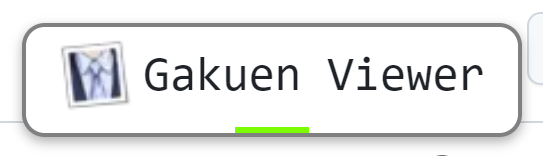

# readme

本仓库存放原始文本。翻译后文本提交至 https://github.com/imas-tools/gakuen-adapted-translation-data

## 如何使用

1. 安装tampermonkey或violentmonkey浏览器扩展后，访问[这里](https://github.com/imas-tools/gakumas-viewer/raw/gkmas/public/viewer-button.user.js)安装用户脚本。
2. 访问本仓库 `data/` 中的对应文件，点击弹窗跳转至翻译界面。
3. 翻译完成后:
   1. 点击底栏的 完成 -> 推送，根据页面提示进行文件提交。或
   2. 点击底栏的 完成 -> 下载。之后手动将文件提交至 [gakuen-adapted-translation-data](https://github.com/imas-tools/gakuen-adapted-translation-data) 仓库的 tmp 目录。

## 翻译相关说明

安装用户脚本后，你可以浏览本仓库的`./data`文件寻找自己想要翻译的文件，点击右上角的弹窗

点击弹窗后可以在 Web GUI 中进行翻译。

注意：访问 Web GUI 页面时可能会弹出“已发现预翻译文件”/“已发现翻译文件”，前者代表有可以用于校对的机翻版本，后者代表该文件已经被翻译过了，请避免重复工作。
